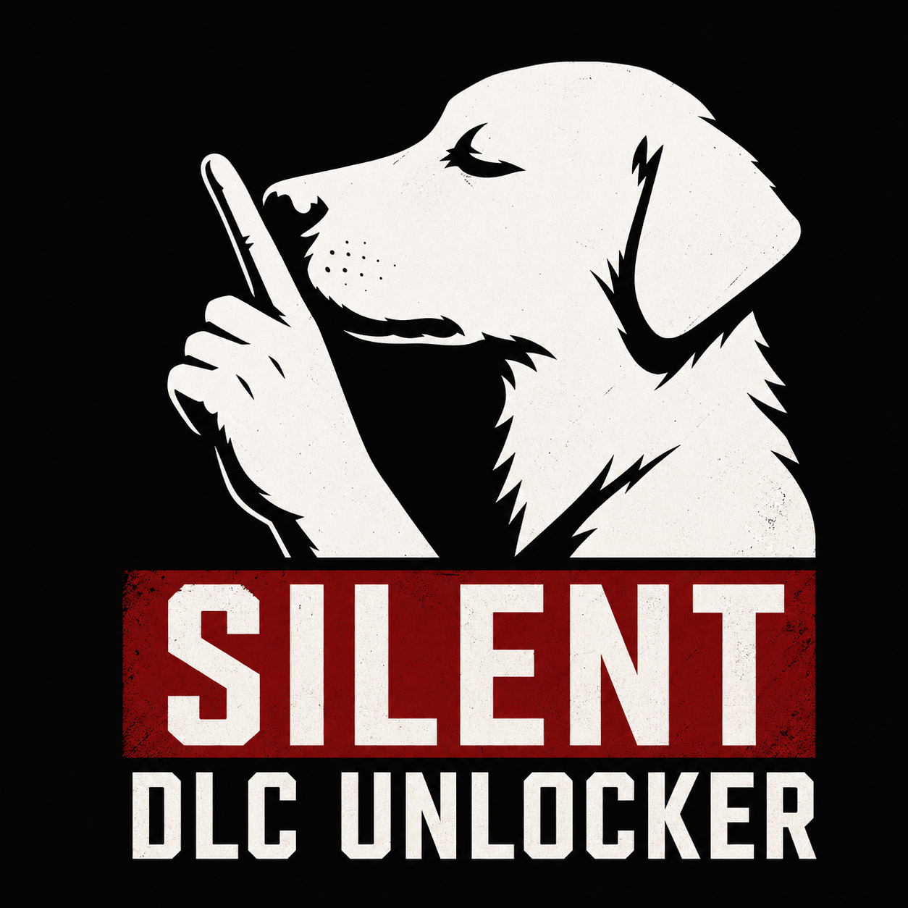
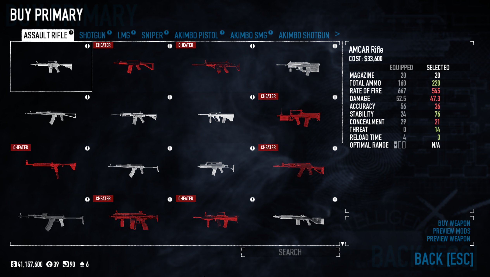

# Silent DLC Unlocker

<p align="center">
  
</p>

<p align="center">
  <strong>A PAYDAY 2 SuperBLT mod with DLC unlocking, ownership-aware warnings, and configurable risk controls.</strong>
</p>

<p align="center">
  
  <a href="LICENSE"></a>
  <a href="https://github.com/wiktorekdev/silentunlocker-pd2/releases/latest"></a>
  <a href="https://github.com/wiktorekdev/silentunlocker-pd2/stargazers"></a>
  <a href="https://github.com/wiktorekdev/silentunlocker-pd2/issues"></a>
</p>

Silent DLC Unlocker unlocks PAYDAY 2 DLC content while keeping your real platform ownership separate. It highlights loadout items and hosted contracts that other players may flag, then lets you block, confirm, or freely allow those actions.

> [!WARNING]
> This is an unofficial fan mod. Unlocking paid content may violate the game's terms of service. Use it at your own risk; buying DLC is the only supported way to own it.

<p align="center">
  
</p>

## Highlights

- Unlocks DLC checks exposed through `_check_dlc_data`, `is_dlc_unlocked`, and `has_dlc`.
- Grants new DLC packages once and repairs safely detectable missing items while skipping malformed loot entries that could crash the game.
- Keeps a separate snapshot of real platform ownership for warnings and guards.
- Mirrors PAYDAY 2's peer verifier for weapons, skin-supplied parts, masks, melee weapons, color skins, hosted characters, and contracts.
- Runs a complete loadout preflight before joining or hosting multiplayer.
- Supports Safe, Normal, and Risky modes, plus an optional Crime.Net filter.
- Marks risky Contract Broker heists before you open their contract details.
- Uses SuperBLT's update system for new GitHub releases.

Unlike basic unlockers that only override `_check_dlc_data`, this mod also handles additional ownership checks and package grants used by newer content. It does not spoof Steam ownership, replace your loadout with dummy items, or act as a skin changer.

## Requirements

- PAYDAY 2 on Windows
- [SuperBLT](https://superblt.znix.xyz/)
- Steam is recommended for live ownership checks. Epic ownership is based on the snapshot available when the mod initializes.

## Installation

1. Install SuperBLT and launch the game once.
2. Download `SilentDLCUnlocker.zip` from the [latest release](https://github.com/wiktorekdev/silentunlocker-pd2/releases/latest).
3. Extract the archive into `PAYDAY 2/mods/`.
4. Confirm that `mod.txt` is directly inside the resulting folder:

   ```text
   PAYDAY 2/
   └── mods/
       └── SilentDLCUnlocker/
           ├── mod.txt
           ├── core.lua
           └── ...
   ```

5. Remove other DLC unlockers to avoid conflicting hooks, then launch the game.

SuperBLT will offer updates in-game when a newer release is published.

## Configuration

Open **Options → Mod Options → Silent DLC Unlocker**.

| Mode | Warning badges | Risky equipment | Hosting an unowned DLC heist |
| --- | :---: | :---: | :---: |
| **Safe** | Shown | Blocked | Blocked |
| **Normal** (default) | Shown | Confirmation prompt | Confirmation prompt |
| **Risky** | Hidden | Allowed | Allowed |

**Hide risky heists on Crime.Net** removes unowned DLC contracts from your offline/host map pool. It does not hide other players' lobbies, because joining a lobby is not the same as hosting its contract.

**Refresh ownership** clears the ownership cache and queries the platform again. **Show package report** displays how many inventory entries were added, repaired, or skipped during the current session.

## Understanding the warning

The warning means that PAYDAY 2 peers may compare an equipped item or hosted contract with your Steam ownership and apply the in-game **CHEATER** tag. Unlocking an item locally does not make the platform report that you own it.

Commonly checked content includes:

- weapons, weapon modifications, weapon colors, and some weapon skins;
- masks, materials, and patterns;
- melee weapons;
- an unowned DLC character when you are the host;
- DLC contracts you host.

Content such as outfits, gloves, perk decks, deployables, throwables, regular weapon skins, skin-supplied weapon parts, and some free/unlockable modifications is not checked through the same DLC ownership path. Game updates can change these rules, so a warning is guidance rather than a guarantee.

Before multiplayer entry, Safe and Normal modes scan the complete equipped primary, secondary, mask, melee weapon, and—when hosting—character and contract. This catches risky equipment restored from an old save or equipped before changing modes.

## Limitations

- Steam Marketplace and inventory skins are separate from DLC ownership.
- Some event cosmetics are stored outside normal DLC tables.
- Steam peers only perform outfit DLC verification for Steam accounts. Hosted characters and contracts remain conservatively checked for Epic cross-play because those game paths do not apply the same account-type guard.
- Normal and Risky modes can still allow an action that results in a tag.
- Conflicting unlocker mods can leave inventory state inconsistent until they are removed and the game is restarted.

## Troubleshooting

**The mod does not appear in Mod Options**

Check that SuperBLT is installed and that there is no extra nested folder such as `mods/SilentDLCUnlocker/SilentDLCUnlocker/mod.txt`.

**Items are still missing or locked**

Remove other unlockers, restart the game, and allow one launch for package grants to run. If the issue remains, include your platform, SuperBLT log, mod list, and affected item in a [bug report](https://github.com/wiktorekdev/silentunlocker-pd2/issues/new?template=bug_report.yml).

**A safe item is marked, or a risky item is not marked**

Open an issue with the exact item name, DLC name, platform, selected mode, and whether the DLC is owned. Ownership mappings can change after PAYDAY 2 updates.

## Contributing

Bug reports and focused pull requests are welcome. Read [CONTRIBUTING.md](CONTRIBUTING.md) before submitting a change. Release history is recorded in [CHANGELOG.md](CHANGELOG.md).

## Credits and license

Inspired by [pd2-stuff/DLC-Unlocker-PD2](https://github.com/pd2-stuff/DLC-Unlocker-PD2).

Created by [wiktorekdev](https://github.com/wiktorekdev) and released under the [MIT License](LICENSE). PAYDAY 2, Starbreeze, Overkill, Steam, and Epic are trademarks of their respective owners; this project is not affiliated with or endorsed by them.
