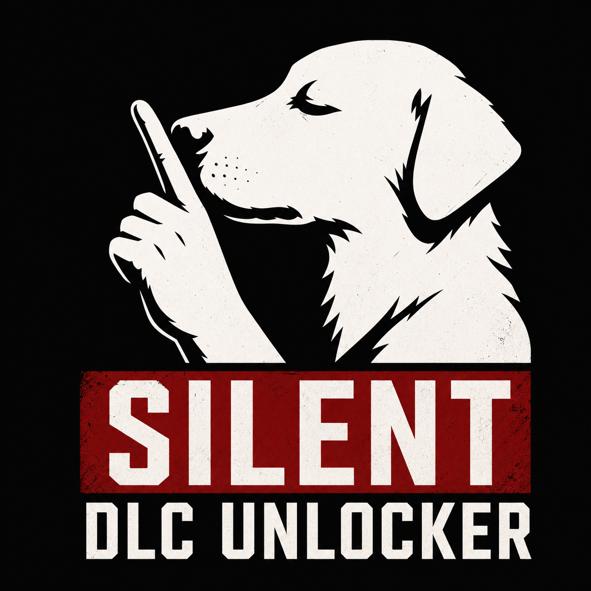
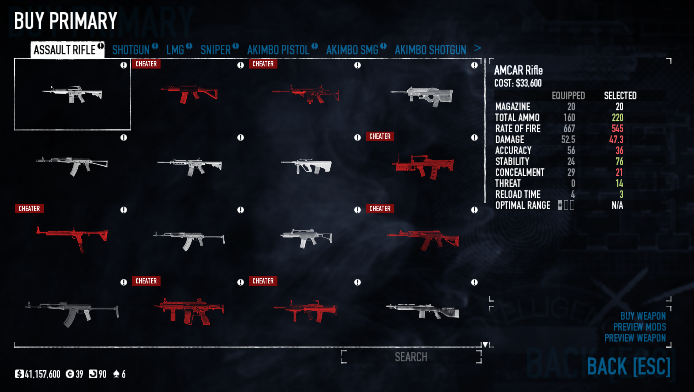

# Silent DLC Unlocker

<p align="center">
  
</p>

<p align="center">
  A PAYDAY 2 SuperBLT mod for unlocking DLC content, with multiplayer warnings and configurable safety controls.
</p>

<p align="center">
  
  <a href="LICENSE"></a>
  <a href="https://github.com/wiktorekdev/silentunlocker-pd2/releases/latest"></a>
  <a href="https://github.com/wiktorekdev/silentunlocker-pd2/stargazers"></a>
</p>

<p align="center">
  
</p>

## Features

* Unlocks PAYDAY 2 DLC content
* Keeps track of your real platform ownership separately
* Warns about equipment that may trigger the in-game **CHEATER** tag
* Checks your loadout before joining or hosting multiplayer
* Marks risky DLC contracts
* Safe, Normal and Risky modes
* Optional Crime.Net filtering
* Automatic updates through SuperBLT

> [!WARNING]
> Unlocking content locally does not make Steam or Epic report that you own it. Other players may still detect unowned DLC and apply PAYDAY 2's **CHEATER** tag.
>
> This is an unofficial fan mod. Use it at your own risk.

## Installation

Requires [SuperBLT](https://superblt.znix.xyz/).

1. Download `SilentDLCUnlocker.zip` from the [latest release](https://github.com/wiktorekdev/silentunlocker-pd2/releases/latest).
2. Extract it into `PAYDAY 2/mods/`.
3. Make sure the folder looks like this:

```text
PAYDAY 2/
└── mods/
    └── SilentDLCUnlocker/
        ├── mod.txt
        ├── core.lua
        └── ...
```

Remove any other DLC unlockers before launching the game to avoid conflicts.

## Modes

Open **Options → Mod Options → Silent DLC Unlocker**.

| Mode       | Warnings | Risky equipment | Unowned DLC heists |
| ---------- | :------: | :-------------: | :----------------: |
| **Safe**   |   Shown  |     Blocked     |       Blocked      |
| **Normal** |   Shown  |    Ask first    |      Ask first     |
| **Risky**  |  Hidden  |     Allowed     |       Allowed      |

**Normal** is the default.

Safe mode is recommended if you want the mod to stop you from accidentally taking flagged equipment into multiplayer.

## Multiplayer

PAYDAY 2 can compare your equipped items and hosted contracts against your real platform ownership.

Silent DLC Unlocker cannot change what another player's game sees. Instead, it warns you about content that may be flagged and, depending on your selected mode, can stop you from using it online.

If you get disconnected a few minutes into a heist, check your loadout for unowned DLC items. Unequip them or use Safe mode before joining again.

## Troubleshooting

**The mod doesn't appear in Mod Options**

Make sure SuperBLT is installed and that `mod.txt` isn't inside an extra nested folder.

**Some items are still locked**

Remove other DLC unlockers and restart the game. Conflicting unlockers can leave the inventory in an inconsistent state.

**Something is incorrectly marked as risky**

[Open an issue](https://github.com/wiktorekdev/silentunlocker-pd2/issues) with the item name, DLC, platform and selected mode.

## Contributing

Bug reports and pull requests are welcome.

See [CONTRIBUTING.md](CONTRIBUTING.md) for development notes and [CHANGELOG.md](CHANGELOG.md) for release history.

## Credits

Inspired by [pd2-stuff/DLC-Unlocker-PD2](https://github.com/pd2-stuff/DLC-Unlocker-PD2).

Created by [wiktorekdev](https://github.com/wiktorekdev).

Released under the [MIT License](LICENSE).
