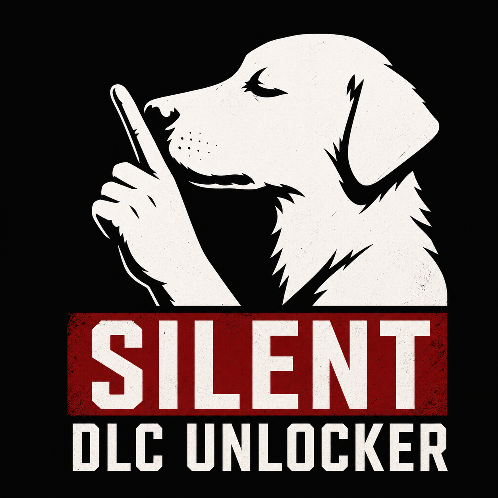
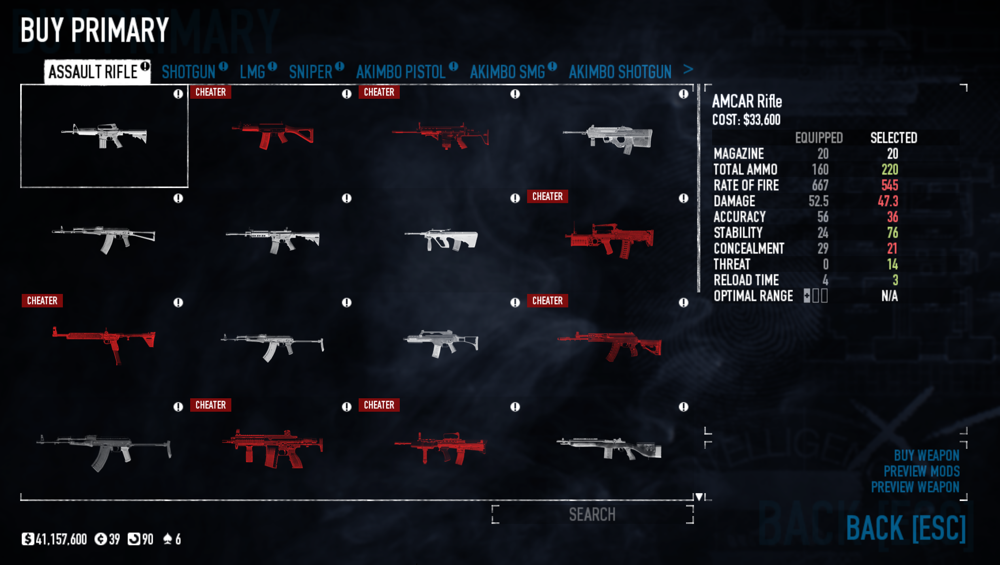

# Silent DLC Unlocker

  

A PAYDAY 2 SuperBLT mod for unlocking DLC locally, with multiplayer warnings and safety controls.

  
  
  
  

## Features

- Unlocks PAYDAY 2 DLC locally.
- Preserves achievement, milestone, and level requirements for earned rewards.
- Separates unlocked content from real platform ownership.
- Warns about equipment and contracts that may trigger the in-game **CHEATER** tag.
- Checks before joining or hosting, with Safe, Normal, and Risky modes.
- Marks risky contracts and can hide them from Crime.Net.

> [!WARNING]
> Unlocking content locally does not make Steam or Epic report that you own it. Other players may still flag unowned DLC. Use it at your own risk.

## Installation

Requires [SuperBLT](https://modworkshop.net/mod/58342).

1. Download `SilentDLCUnlocker.zip` from the [latest release](https://github.com/wiktorekdev/silentunlocker-pd2/releases/latest).
2. Extract it into `PAYDAY 2/mods/` so `mod.txt` is at `mods/SilentDLCUnlocker/mod.txt`.
3. Remove other DLC unlockers, then start the game.

## Modes

Open **Options → Mod Options → Silent DLC Unlocker**.

| Mode | Risky multiplayer actions |
| --- | --- |
| **Safe** | Blocked |
| **Normal** | Confirm before continuing |
| **Risky** | Allowed without warnings |

Normal is the default. Safe is the sensible choice for public lobbies.

Offline, you can equip items and attach weapon parts freely in every mode. Safe and Normal still show risk badges. Your equipped loadout is checked before joining or hosting multiplayer, and online equipment changes follow the selected mode.

Version 1.6 repairs unearned achievement and milestone rewards granted by older versions, including Tombstone Slug. It checks the game's unlock conditions and preserves rewards with another valid source. Installed parts, masks, cosmetics, and saved profiles are repaired too; paid DLC remains locally unlocked.

The repair waits for a successful achievement fetch and writes a recovery snapshot to `mods/saves/silent_dlc_progression_backup_*.json` before changing the loaded save. Missing achievement data or a backup failure postpones the affected repair. Start the game with 1.6 installed and let the game save before removing the mod. This does not restore the entire inventory to its pre-mod state; keep a copy of your PAYDAY 2 save before updating.

## Multiplayer

The mod cannot change what another player's game sees. It can only warn or stop you before you take a risky loadout or contract online. Steam ownership is checked against the game's APIs; Epic/TDVS behavior is not tested in-game.

If something is marked incorrectly, [open an issue](https://github.com/wiktorekdev/silentunlocker-pd2/issues) with the item, DLC, platform, selected mode, and relevant SuperBLT log lines.

## Contributing

See [CONTRIBUTING.md](CONTRIBUTING.md). Release history is in [CHANGELOG.md](CHANGELOG.md).

Inspired by [DLC-Unlocker-PD2](https://github.com/pd2-stuff/DLC-Unlocker-PD2). Released under the [MIT License](LICENSE).
